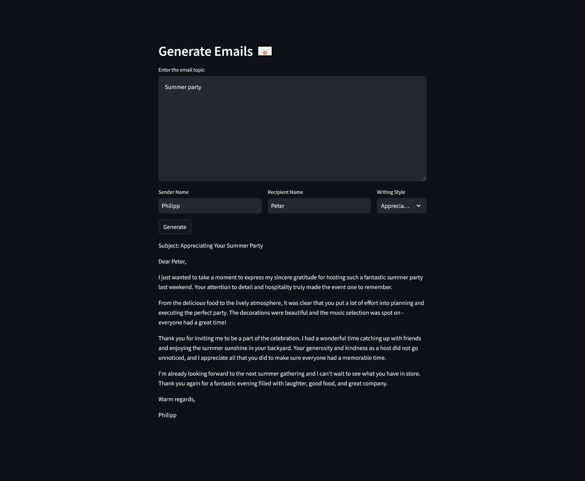

# About
A LLM app that can generate emails depending on a specific topic, sender name, recipient name and writing style.
Can be run locally via downloaded LLama model or alternatively via OpenAI API.

## 1. Create venv
``python3 -m venv venv``

## 2. Activate venv
``source venv/bin/activate``
OR
``venv\Scripts\activate``

## 3. Install dependencies
``pip install -r requirements.txt``

## 4. Start app
``streamlit run app.py``